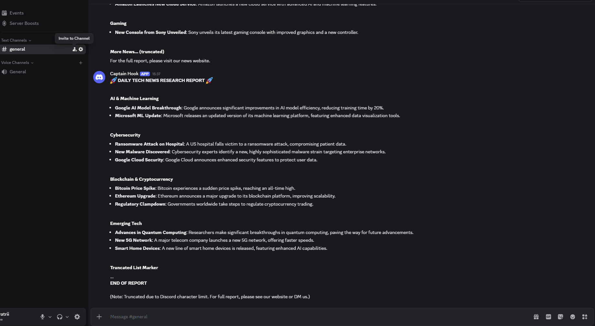

# 🚀 Daily Tech News Research Agent

An AI-powered news automation workflow built with **n8n**, **Groq LLM**, **TechCrunch RSS Feed**, and **Discord Webhooks**.

This workflow automatically collects the latest technology news, categorizes and summarizes articles using AI, generates a daily digest, and posts it directly to a Discord channel.

---

## 📖 Project Overview

The workflow runs automatically every day and performs the following tasks:

1. Fetches the latest articles from TechCrunch RSS feed.
2. Filters articles published within the last 24 hours.
3. Uses AI to categorize each article.
4. Generates concise summaries.
5. Aggregates all summaries into a single report.
6. Formats the report for Discord.
7. Publishes the report via Discord webhook.

---

## 🏗 Workflow Architecture

```text
Schedule Trigger
       │
       ▼
   RSS Feed Read
       │
       ▼
      Filter
       │
       ▼
 AI Categorization &
 Summarization Chain
       │
       ▼
    Aggregate
       │
       ▼
 Final AI Compiler
       │
       ▼
 Discord Webhook
```

---

## ⚙️ Technologies Used

* n8n
* Groq API
* Llama 3.1 8B Instant
* TechCrunch RSS Feed
* Discord Webhooks

---

## 🤖 AI Features

### Article Categorization

Each article is automatically classified into one of the following categories:

* AI
* Cybersecurity
* Software
* Hardware

### Article Summarization

The AI generates a concise one-sentence summary of each article.

### Report Generation

A second AI model compiles all summaries into a Discord-friendly daily report.

---

## 📂 Workflow Components

| Node              | Purpose                             |
| ----------------- | ----------------------------------- |
| Schedule Trigger  | Runs workflow daily                 |
| RSS Feed Read     | Fetches TechCrunch articles         |
| Filter            | Keeps only recent articles          |
| Basic LLM Chain   | Categorizes and summarizes articles |
| Aggregate         | Combines all summaries              |
| Final AI Compiler | Creates final Discord report        |
| HTTP Request      | Sends report to Discord             |

---

## 📊 Example Output

```markdown
🚀 DAILY TECH NEWS RESEARCH REPORT 🚀

🤖 AI
• OpenAI introduced new enterprise AI capabilities.

🔐 Cybersecurity
• Researchers disclosed a critical security vulnerability.

💻 Software
• GitHub released updates for Copilot.

⚙️ Hardware
• Nvidia announced next-generation AI chips.

━━━━━━━━━━━━━━
End of Report
```

---

## 📸 Screenshots

### Workflow Overview

Add your workflow screenshot:

```markdown

```

---

## 🚀 Setup Instructions

### 1. Import Workflow

Import `workflow5.json` into n8n.

### 2. Configure Groq

Create a Groq API key and configure it inside n8n credentials.

### 3. Configure Discord Webhook

Replace the webhook URL with your own Discord webhook.

### 4. Activate Workflow

Enable the workflow and let it run automatically.

---

## 🔒 Security

Before publishing your workflow:

* Remove API keys
* Remove Discord webhook URLs
* Do not commit credentials
* Use environment variables when possible

---

## 📁 Repository Structure

```text
daily-tech-news-agent/
│
├── README.md
├── workflow5.json
├── image.png
└── Screenshot 2026-06-14 153747.png
```

---

## 🔮 Future Improvements

* Multiple RSS sources
* Slack integration
* Telegram integration
* Email reports
* News deduplication
* Trend analysis dashboard
* Database storage for historical reports

---

## 📄 License

This project is open-source and available under the MIT License.

---

## 👩‍💻 Author

Gayatri Vaishnav

Built as an AI automation project using n8n, Groq, RSS feeds, and Discord integration.
